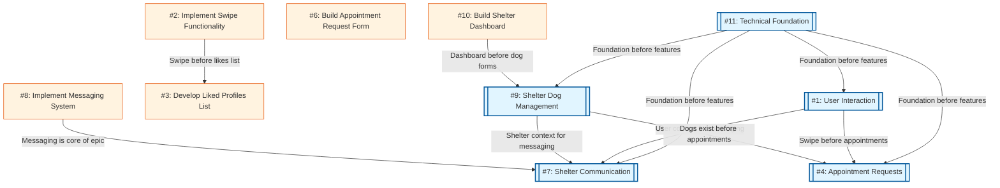
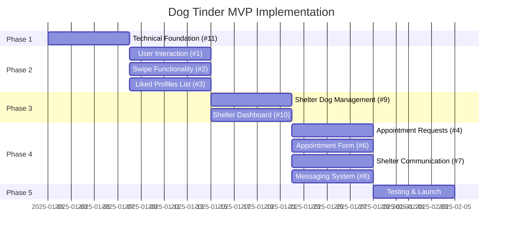

# Dependency Graph



## Implementation Phases



## Legend
- **Double box [[]]**: Epic (major feature area)
- **Single box []**: Task (specific implementation work)
- **Arrow direction**: Dependency flow (A → B means B depends on A)

## Active Issues (MVP)

| Issue | Type | Title | Phase | Status |
|-------|------|-------|-------|--------|
| #11 | Epic | Technical Foundation | Week 1 | ✅ Closed |
| #1 | Epic | User Interaction | Week 2 | ✅ Closed |
| #2 | Task | Implement Swipe Functionality | Week 2 | ✅ Closed |
| #3 | Task | Develop Liked Profiles List | Week 2 | ✅ Closed |
| #9 | Epic | Shelter Dog Management | Week 3 | ✅ Closed |
| #10 | Task | Build Shelter Dashboard | Week 3 | ✅ Closed |
| #4 | Epic | Appointment Requests (Simplified) | Week 4 | 🔴 Open |
| #6 | Task | Build Appointment Request Form | Week 4 | 🔴 Open |
| #7 | Epic | Shelter Communication | Week 4 | 🔴 Open |
| #8 | Task | Implement Messaging System | Week 4 | 🔴 Open |

## Closed Issues (Deferred to Post-MVP)

| Issue | Title | Reason |
|-------|-------|--------|
| #5 | Integrate Calendar API | Simplified to form-based requests |

## Dependency Details

### Epic #11: Technical Foundation
**Depends on:** Nothing (starting point)
**Blocks:** All other epics

This is the foundation that everything else builds upon:
- Next.js project setup
- SQLite (dev) / Turso (prod) + Drizzle ORM database
- NextAuth.js authentication (email/password)
- Vercel deployment

### Epic #1: User Interaction
**Depends on:** #11 (Technical Foundation)
**Blocks:** #4 (Appointment Requests), #7 (Shelter Communication)

Core user-facing features:
- Swipe interface
- Dog profile details
- Liked dogs list

### Epic #9: Shelter Dog Management
**Depends on:** #11 (Technical Foundation)
**Blocks:** #4 (Appointment Requests), #7 (Shelter Communication)

Shelter admin features:
- Dashboard
- Dog CRUD operations
- Image upload

### Epic #7: Shelter Communication
**Depends on:** #11, #1, #9 (needs foundation, user context, and shelter context)
**Blocks:** Nothing

In-app messaging features:
- Real-time chat between users and shelters
- Conversation management
- Message notifications

### Epic #4: Appointment Requests
**Depends on:** #11, #1, #9 (needs foundation, user flow, and dogs)
**Blocks:** Nothing

Final user journey step:
- Request form
- Email notifications
- Status management

## Development Flow

1. **Start with #11 (Technical Foundation)**
   - Set up project, database, auth, deployment
   - This unblocks all other work

2. **Phase 2: #1 (User Interaction)**
   - Swipe interface
   - Dog profiles
   - Liked dogs list

3. **Phase 3: #9 (Shelter Dog Management)**
   - Shelter dashboard
   - Dog CRUD operations
   - Image upload

4. **Phase 4: #4 and #7 (Appointments & Communication)**
   - Can be developed in parallel
   - #4: Appointment request forms and email notifications
   - #7: In-app messaging system
   - Both require user and shelter contexts from earlier phases

5. **Phase 5: Testing & Launch**
   - End-to-end testing
   - Performance optimization
   - Production deployment

## About This Diagram

This diagram shows the dependencies between epics and tasks for the Dog Tinder MVP. Use it to understand the order in which work should be completed.

- **Epics** (double boxes) represent major features or components
- **Tasks** (single boxes) are specific implementation work items
- **Arrows** show dependencies (A → B means B depends on A completing first)

For parallel development using git worktrees, run:
```bash
./confabulator/setup-worktrees.sh
```
