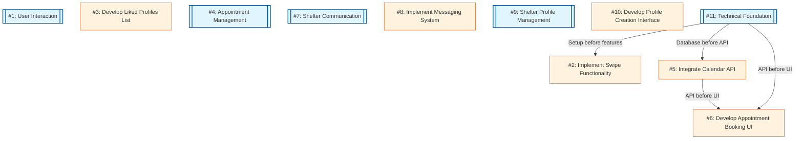

# Dependency Graph



## Legend
- **Double box**: Epic
- **Single box**: Task
- **Arrow direction**: Dependency flow (A → B means B depends on A)

## About This Diagram

This diagram shows the dependencies between epics and tasks in your project. Use it to understand the order in which work should be completed and merged.

- **Epics** (double boxes) represent major features or components
- **Tasks** (single boxes) are specific implementation work items
- **Arrows** show dependencies (A → B means B depends on A completing first)

For parallel development using git worktrees, run:
```bash
./confabulator/setup-worktrees.sh
```
